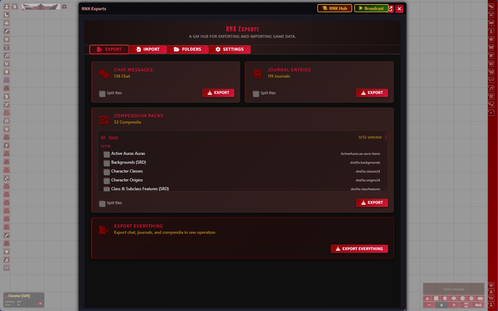
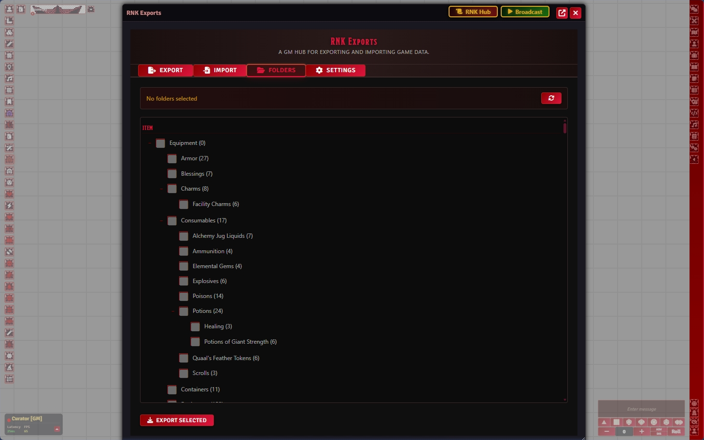
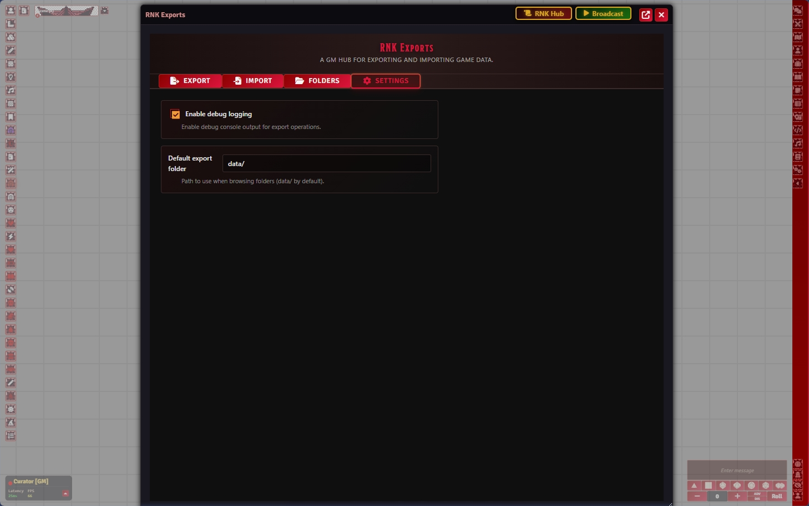

# RNK Exports

**Module**: rnk-exports  
**Compatibility**: Foundry VTT v13+ (minimum: 13, verified: 13)  
**License**: RNK Proprietary License

## Purpose

RNK Exports provides a comprehensive system for exporting Foundry VTT data into portable ZIP archives for backups, sharing, and migration. Users can selectively export chat history, journals, compendium contents, and file folders with a user-friendly interface.

## Features

- Export chat messages and conversation history to plaintext or JSON
- Export journal entries and pages with formatting preserved
- Export compendium pack contents (actors, items, journals, macros) as JSON payloads
- By default, compendium export splits each entry into an individual JSON file (per-item file export)
- Supports one JSON per item for Martian style export, matching manual per-item export behavior
- Export world data folders and subfolders with recursion as JSON files
- JSON output includes document data; metadata files are removed to keep exports clean, and readable .txt companion files are optional via settings
- Multi-folder selection with checkbox-based UI
- Foundry v13 ApplicationV2 architecture
- Crimson Blood Gothic theme with responsive design
- Event delegation architecture for efficient event handling

## Module Structure

```
rnk-exports/
├── module.json          # Manifest file
├── package.json         # NPM package metadata
├── CHANGELOG.md         # Version history
├── README.md            # This file
├── LICENSE              # RNK Proprietary License
├── src/
│   ├── main.js          # Module initialization
│   ├── apps/
│   │   └── ExportHubApp.js   # UI application (ApplicationV2)
│   └── utils/
│       └── exportHelpers.js  # Export utility functions
├── templates/
│   └── export-hub.hbs   # Main UI template
├── styles/
│   └── module.css       # Complete theme styling
└── lang/
    └── en.json          # English localization
```

## Installation

1. Copy the module folder to your Foundry VTT `modules` directory
2. Enable the module in your world settings
3. Grant admin/GM permissions for access to export features

## Usage

1. Open the RNK Exports hub from the scene controls toolbar
2. Select from available export options on the Dashboard panel
3. Configure export settings if desired
4. Choose specific folders (if exporting folder data)
5. Click export button to download ZIP archive

## Screenshots

Below are the current module panel screenshots:

### RNK Exports Screenshot 1


### RNK Exports Screenshot 2


### RNK Exports Screenshot 3


## Export Types

- **Chat Export**: Saves all chat messages as JSON and companion human-readable .txt
- **Journal Export**: Copies all journal entries as JSON and companion human-readable .txt
- **Compendium Export**: Extracts pack contents to JSON and companion human-readable .txt
- **Folder Export**: Exports directory structure JSON files and companion human-readable .txt copies (no separate metadata file)

## Technical Details

- **Framework**: Foundry VTT v13 ApplicationV2
- **Architecture**: Event delegation with centralized handler
- **Styling**: CSS variables with responsive media queries
- **API Compliance**: v13 FilePicker with proper lifecycle management

## Known Limitations

- Folder export limited to `/worlds` directory structure
- Individual folder exports create separate ZIPs (batch mode planned)
- Theme optimized for dark mode environments
- Large exports may require extended processing time

## Future Versions

### v0.2.0
- Batch ZIP creation (single download for multiple folders)
- Import/restore from exported bundles
- Progress indicators for large exports

### v0.3.0
- Custom filtering (date range, entity type)
- Export templates and presets
- External backup service integration

### v1.0.0
- Public release with full feature parity
- Comprehensive API documentation

## License

RNK Proprietary License. See LICENSE file for details.

## Support

For issues, questions, or contributions, contact RNK Enterprise.

---

**Author**: RNK Enterprise  
**Last Updated**: March 17, 2026
